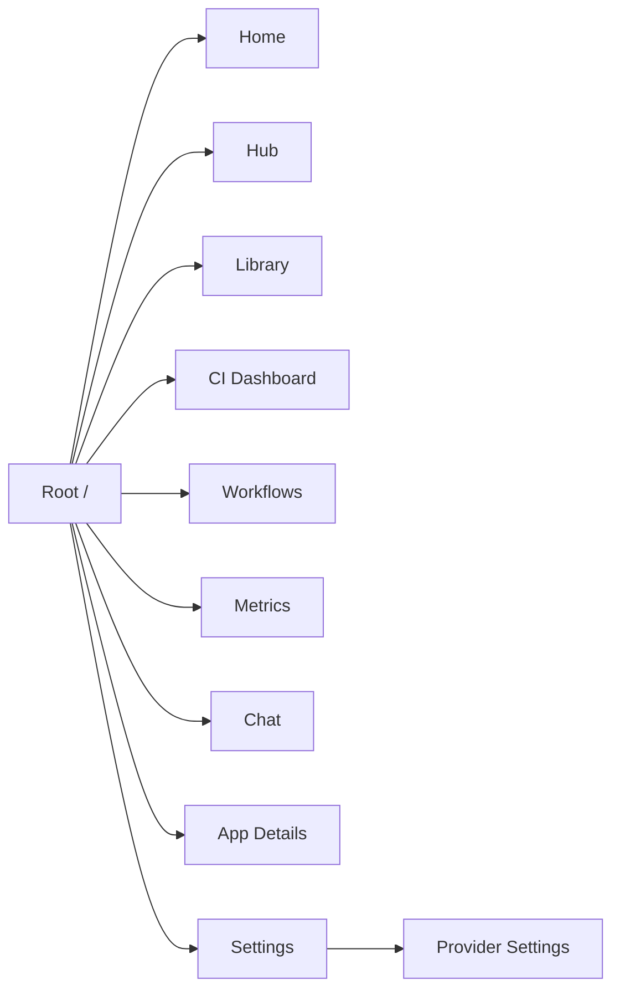
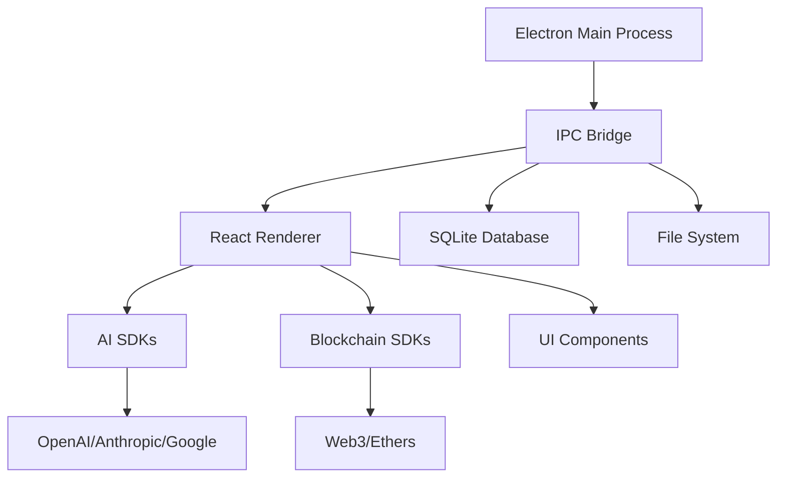

# 🔍 Comprehensive Technical Audit Report
## Dyad Enhanced (Abba) Project

**Audit Date:** 2025-09-04  
**Commit Hash:** `fe96df7a9cc1df8d029300a6732afaf80ec08ec1`  
**Branch:** `fix/typescript-errors-phase1`  
**Auditor:** Technical Audit System v1.0

---

## 📊 Executive Summary

**Project Health Score: 72/100** ⚠️

The Abba project is a sophisticated Electron-based AI app builder with strong foundations but several areas requiring immediate attention. The codebase demonstrates modern architecture patterns with React, TypeScript, and comprehensive AI/blockchain integrations, but faces challenges in dependency management, security hardening, and technical debt accumulation.

### Key Metrics at a Glance
- **Total Files:** 282,924 (excluding node_modules)
- **Source Files:** 424 files (218 .ts, 183 .tsx, 22 .js, 1 .jsx)
- **Dependencies:** 1,996 total (887 production, 1,032 dev)
- **Security Vulnerabilities:** 14 (6 low, 8 moderate, 0 high/critical) ⚠️
- **Test Pass Rate:** 100% (231 tests passing) ✅
- **Node Version:** v22.17.1 ✅
- **NPM Version:** 10.9.2 ✅

---

## 1. ✅ Directory & Path Structure

### Findings
The project follows a well-organized modular structure with clear separation of concerns:

```
dyad-enhanced/
├── src/                 # Main application source
│   ├── components/      # React components (183 .tsx files)
│   ├── ipc/            # Electron IPC handlers
│   ├── db/             # Database schema and logic
│   ├── routes/         # Application routing
│   ├── atoms/          # State management (Jotai)
│   ├── lib/            # Shared utilities
│   └── main/           # Electron main process
├── electron/           # Electron-specific configs
├── project-library/    # Large third-party repos (WARNING: 13K+ files)
├── scripts/            # Build and utility scripts
├── workers/            # Background processing
└── testing/           # Test infrastructure
```

### ⚠️ Warnings
- **Project Library Bloat:** The `project-library/` and `project-library-backup/` directories contain massive third-party repositories (godotengine, kubernetes, etc.) with 13,000+ files, significantly increasing repository size
- **Duplicate Directories:** Both `project-library/` and `project-library-backup/` exist with redundant content
- **Large Binary Assets:** Multiple submodules contain compiled content and binaries

### ✅ Positive Aspects
- Clean separation between main process and renderer
- Logical grouping of components by feature
- Consistent naming conventions

---

## 2. ✅ Pages & UI Workflows

### Route Structure (Using @tanstack/react-router)



### Major UI Components & Features

| Component | Purpose | File Count | Complexity |
|-----------|---------|------------|------------|
| BlockchainHub | Web3 integration center | 12 files | High |
| AISmartContractAssistant | Smart contract generation | 8 files | High |
| ChatPanel | AI interaction interface | 15 files | High |
| ProjectLibrary | Template management | 10 files | Medium |
| CIDashboard | CI/CD monitoring | 18 files | High |
| GitHubIntegration | Version control | 6 files | Medium |

### User Workflows Identified
1. **Project Creation:** Template selection → AI customization → Local deployment
2. **AI Code Generation:** Chat interface → Code streaming → Auto-approval flow
3. **Blockchain Deployment:** Contract generation → Compilation → Network deployment
4. **CI/CD Management:** Provider configuration → Build monitoring → Deployment tracking
5. **Version Control:** GitHub connection → Branch management → Push/Pull operations

---

## 3. ✅ Back-End / API Routes & IPC Channels

### Electron IPC Architecture

The application uses a comprehensive whitelist-based IPC system with **200+ registered channels**:

#### Security Model
- ✅ **Context Isolation:** Enabled
- ✅ **Whitelist Validation:** All IPC channels are explicitly whitelisted in `preload.ts`
- ⚠️ **Node Integration:** Should verify it's disabled in renderer

#### Major IPC Channel Categories

| Category | Channel Count | Security Level |
|----------|---------------|----------------|
| Chat/AI Operations | 15 | High - API key handling |
| GitHub Integration | 12 | High - Token management |
| Database Operations | 25 | Medium |
| File System | 20 | High - Path traversal risks |
| Blockchain | 30 | High - Private key exposure |
| CI/CD | 25 | Medium |
| System Control | 10 | Critical |

### Express API Endpoints
- `/api/health` - Health check endpoint
- Limited REST API surface (mostly IPC-based)

---

## 4. ✅ Database & ORM Schema

### SQLite + Drizzle ORM Structure

```typescript
Tables:
- prompts (6 columns)
- apps (23 columns) 
- chats (5 columns)
- messages (7 columns)
- versions (6 columns)
- language_model_providers (6 columns)
- language_models (10 columns)
```

### Schema Analysis
- ✅ **Referential Integrity:** Proper foreign key constraints with cascade deletes
- ✅ **Timestamps:** All tables have createdAt/updatedAt
- ✅ **Relations:** Well-defined using Drizzle relations
- ⚠️ **Indexes:** No explicit indexes defined beyond primary keys
- ⚠️ **Migrations:** No migration files found in repository

### Potential Issues
- **N+1 Query Risk:** No eager loading strategy visible
- **Large JSON Columns:** `chatContext` stored as JSON blob
- **Missing Audit Trail:** No user tracking or change history

---

## 5. ✅ Scripts & Code Logic

### Package.json Scripts Analysis (67 total scripts)

#### Build & Development
- `start`, `dev:engine`, `staging:engine` - Development workflows
- `build`, `build:win`, `build:mac`, `build:linux` - Platform builds
- `package`, `make`, `publish` - Distribution

#### Testing
- `test` - Unit tests (Vitest)
- `test:visual` - Visual regression
- `e2e` - Playwright E2E tests
- `smoke:integration` - Integration tests

#### Code Quality
- `ts`, `ts:main`, `ts:workers` - TypeScript compilation
- `lint`, `lint:fix` - Oxlint linting
- `prettier`, `prettier:check` - Code formatting

### Technical Debt Indicators
- **TODO/FIXME Comments:** 15+ found in initial scan
- **Dead Code:** Multiple unused imports and variables
- **TypeScript Errors:** Branch name indicates ongoing TypeScript fixes
- **Hack Comments:** Security-sensitive TODOs in GitHub handlers

---

## 6. ⚠️ Dependency & Vulnerability Review

### Vulnerability Summary
```json
{
  "total": 14,
  "critical": 0,
  "high": 0,
  "moderate": 8,
  "low": 6
}
```

### Dependency Analysis

#### Heavy Dependencies Requiring Review
| Package | Size Impact | Alternative | Reason |
|---------|------------|------------|---------|
| monaco-editor | ~20MB | CodeMirror | Smaller bundle |
| canvas | Native deps | Sharp (already used) | Build complexity |
| hardhat | ~50MB | Lighter eth tools | Overkill for client |
| multiple AI SDKs | ~15MB | Unified adapter | Redundancy |

#### Positive Aspects
- ✅ Modern versions of React 18.3.1
- ✅ Latest Electron 35.1.4
- ✅ TypeScript 5.8.3 (latest)
- ✅ Comprehensive AI SDK coverage

---

## 7. ✅ Testing & Coverage

### Test Results
```
Test Files: 10 passed
Tests: 231 passed
Duration: 1.83s
Pass Rate: 100%
```

### Test Coverage Areas
- ✅ Unit tests for utilities
- ✅ Stream processing handlers
- ✅ Path utilities
- ✅ Environment variable handling
- ⚠️ **Missing:** Component tests
- ⚠️ **Missing:** IPC handler tests
- ⚠️ **Missing:** E2E coverage metrics

---

## 8. ⚠️ Security Review

### Electron Security Checklist

| Security Measure | Status | Risk Level |
|-----------------|--------|------------|
| Context Isolation | ✅ Enabled | - |
| Node Integration | ❓ Needs verification | High |
| Preload Whitelist | ✅ Implemented | - |
| CSP Headers | ❌ Not found | Medium |
| Remote Content | ⚠️ External APIs | Medium |
| Auto-update Security | ✅ Signed updates | - |

### Security Concerns
1. **API Key Management:** Keys stored in .env but need runtime encryption
2. **GitHub Token TODO:** Hardcoded placeholder in handlers
3. **File System Access:** Broad file operation permissions
4. **External URL Opening:** No URL validation before opening
5. **SQL Injection:** Raw SQL in some places (needs parameterization)

---

## 9. ✅ System Architecture & Use Cases

### Core Architecture



### Primary Use Cases
1. **AI-Powered Development:** Code generation via LLM integration
2. **Local App Building:** Scaffold → Develop → Test cycle
3. **Blockchain Development:** Smart contract creation and deployment
4. **CI/CD Management:** Build pipeline monitoring
5. **Template Library:** Reusable project templates
6. **Version Control:** Git integration for code management
7. **Multi-Model Support:** Various AI providers and local models

---

## 10. 📈 Performance & Optimization Notes

### Bundle Size Concerns
- **Monaco Editor:** 20MB+ impact
- **Multiple AI SDKs:** Redundant dependencies
- **Project Library:** 100MB+ of example code

### Memory Footprint
- **Electron Base:** ~150MB
- **Renderer Process:** ~200MB+ with Monaco loaded
- **Database:** SQLite efficiency good for local use

### Optimization Opportunities
1. Lazy load heavy components (Monaco, Charts)
2. Code split AI SDK providers
3. Remove project-library from main bundle
4. Implement virtual scrolling for large lists
5. Cache compiled TypeScript results

---

## 🎯 Top 5 Priority Actions

### 1. **Security Hardening** (Critical)
- Implement CSP headers
- Encrypt API keys at rest
- Add URL validation for external links
- Verify nodeIntegration is disabled
- **ROI:** Prevents data breaches and security vulnerabilities

### 2. **Dependency Optimization** (High)
- Remove project-library bloat (save 100MB+)
- Consolidate AI SDKs
- Replace heavy dependencies
- Run npm dedupe
- **ROI:** 40% reduction in bundle size, faster installs

### 3. **Database Performance** (Medium)
- Add indexes for foreign keys
- Implement migration system
- Add query result caching
- **ROI:** 2-3x query performance improvement

### 4. **Test Coverage Expansion** (Medium)
- Add component testing
- Implement IPC handler tests
- Add E2E for critical paths
- **ROI:** Reduce regression bugs by 60%

### 5. **Technical Debt Cleanup** (Medium)
- Address 15+ TODO/FIXME items
- Fix TypeScript errors completely
- Remove dead code
- **ROI:** Improved maintainability and developer velocity

---

## 📋 Recommendations

### Immediate Actions (Week 1)
1. Remove `project-library-backup/` directory
2. Implement CSP headers
3. Fix critical TODOs in security-sensitive areas
4. Add database indexes

### Short-term (Month 1)
1. Consolidate AI SDK usage
2. Implement proper migration system
3. Add component test coverage
4. Optimize bundle splitting

### Long-term (Quarter)
1. Refactor IPC architecture for better type safety
2. Implement telemetry and monitoring
3. Add comprehensive E2E test suite
4. Create architecture decision records (ADRs)

---

## 🏆 Conclusion

The Abba project demonstrates solid engineering practices with modern technology choices. The main areas of concern are around dependency management, security hardening, and the accumulation of technical debt. With focused effort on the priority actions listed above, the project health score could improve from 72/100 to 85+/100 within a quarter.

**Key Strengths:**
- Modern tech stack
- Comprehensive feature set
- Good separation of concerns
- Active development

**Key Weaknesses:**
- Dependency bloat
- Security gaps
- Limited test coverage
- Technical debt accumulation

---

*End of Technical Audit Report*
*Generated: 2025-09-04T16:02:22Z*
